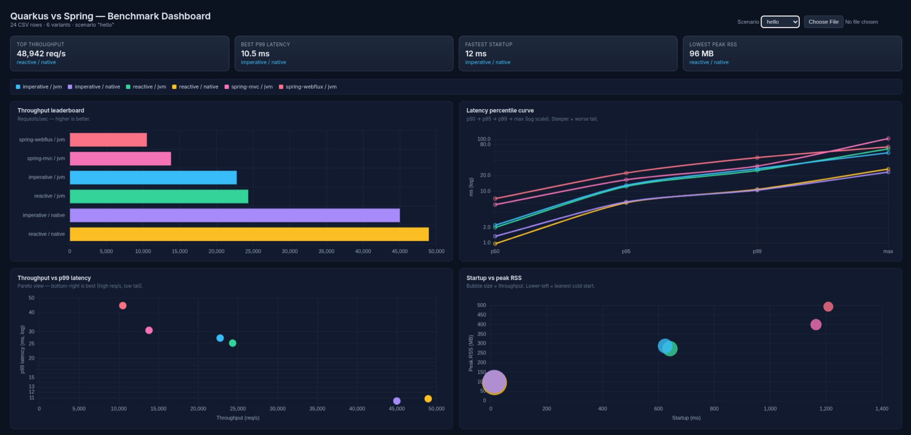

# Quarkus vs Spring Boot Performance Benchmark

Comparison of six runtime variants across four workload shapes:

| Framework | Mode | Variant |
|---|---|---|
| Quarkus | imperative (blocking, RESTEasy Reactive) | JVM + native |
| Quarkus | reactive (Mutiny / Vert.x event loop) | JVM + native |
| Spring Boot | Spring MVC (blocking, Tomcat) | JVM only |
| Spring Boot | Spring WebFlux (reactive, Netty + Reactor) | JVM only |

Workloads: lightweight JSON (`hello`), CPU-bound (`cpu`), allocation pressure (`memory`), and simulated I/O (`io`).

| Scenario | Path | Workload |
|---|---|---|
| `hello` | `/{mode}/hello` | Lightweight JSON, no work |
| `cpu` | `/{mode}/cpu` | Recursive Fibonacci(35) — pure CPU, deterministic |
| `memory` | `/{mode}/memory` | Allocate + fill 10 MB `byte[]`, return checksum — stresses allocator and GC |
| `io` | `/{mode}/io` | Artificial ~200 ms delay (simulates external call / DB wait) — reactive variant uses non-blocking suspension |

> Each app exposes its own path prefix (`/imperative`, `/reactive`, `/spring-mvc`, `/spring-webflux`); native binaries serve the same paths as their JVM counterparts.

---

## Architecture

### Four codebases, six runtime variants

| Module | Stack | JVM port | Native binary |
|---|---|---|---|
| `imperative-app/` | Quarkus `quarkus-rest` (blocking) + Jackson + CDI | 8080 | `imperative-app-1.0.0-SNAPSHOT-runner` |
| `reactive-app/` | Quarkus `quarkus-rest` returning `Uni<T>` + Mutiny | 8081 | `reactive-app-1.0.0-SNAPSHOT-runner` |
| `spring-mvc-app/` | Spring Boot 3.4 + Spring MVC + embedded Tomcat | 8082 | — (JVM only) |
| `spring-webflux-app/` | Spring Boot 3.4 + Spring WebFlux + Reactor + embedded Netty | 8083 | — (JVM only) |

Quarkus apps run as JVM (`java -jar target/quarkus-app/quarkus-run.jar`) **or** as AOT-compiled native binaries (`-Pnative` profile, GraalVM Mandrel via container build). Spring apps run as standard fat-jars (`java -jar target/spring-*-app-1.0.0-SNAPSHOT.jar`); Spring native is possible via `spring-boot-maven-plugin`'s native goal but adds substantial build complexity, so we kept Spring JVM-only for this comparison.

### Why no separate `native-app/` module?

We chose to make `native` a *build profile* on each Quarkus app instead of a third source tree. The imperative-native and reactive-native binaries are byte-identical to their JVM siblings except for the AOT compilation step. Comparing JVM vs native within the same codebase is more meaningful than diverging the sources.

### Workload equivalence (this is non-negotiable for a fair benchmark)

- **CPU**: identical recursive `fib(35)` across all four codebases. Returns `9227465`. Both reactive apps (Quarkus reactive and Spring WebFlux) offload to a CPU-sized worker pool — Quarkus uses a fixed `nCPU` pool, WebFlux uses `Schedulers.parallel()`. That's the correct reactive idiom for CPU-bound work.
- **memory**: allocates a 10 MB `byte[]`, fills it byte-by-byte with `i % 256`, computes a checksum, returns `{bytes_allocated, checksum, elapsed_ms}`. The checksum is what defeats dead-code elimination — without it, escape analysis would let the JIT remove the allocation entirely. Reactive variants offload the fill loop to the worker pool (the loop is several ms of CPU + memory bandwidth — would stall the event loop). This scenario stresses allocator throughput, GC behavior, and heap growth dynamics.
- **hello**: returns a small JSON map; no work. Pure framework overhead measurement.

---

## Build & Run

### Prerequisites

- Java 21
- Maven 3.9+
- `podman` (Docker also works if you swap the runtime in the POMs)
- `k6` (for benchmarking)

### Development mode (JVM only)

```bash
cd imperative-app
quarkus dev   # or: mvn quarkus:dev
```

`quarkus dev` runs **JVM mode only** with hot reload. Native images are AOT-compiled and cannot support live class reloading, so there is no native dev mode.

### Build everything at once

```bash
./build-all.sh
```

Runs `mvn clean package -DskipTests` for every module (producing the JVM jars for all four apps) and then `mvn package -Pnative -DskipTests` for the two Quarkus apps (producing the `-runner` native binaries). This is what `benchmarks/run-all.sh` expects — use it instead of remembering which module needs which Maven invocation. Spring apps are JVM-only by design (see *Architecture* above).

### JVM mode

```bash
# Build both apps from the project root
mvn -DskipTests package

# Run (each in its own terminal)
java -jar imperative-app/target/quarkus-app/quarkus-run.jar   # :8080
java -jar reactive-app/target/quarkus-app/quarkus-run.jar     # :8081

# Hit them
curl http://localhost:8080/imperative/hello
curl http://localhost:8081/reactive/hello
```

### Native mode

Native build is configured to use **podman** as the container runtime (set in each app's `pom.xml`). First run pulls the Mandrel builder image (~1 GB).

```bash
# Build both native binaries from the project root
mvn -pl imperative-app -am package -Pnative -DskipTests
mvn -pl reactive-app  -am package -Pnative -DskipTests

# Run them directly (no JVM needed)
./imperative-app/target/imperative-app-1.0.0-SNAPSHOT-runner   # :8080
./reactive-app/target/reactive-app-1.0.0-SNAPSHOT-runner       # :8081
```

> **Maven flags explained:** `-pl imperative-app` tells Maven to build only that module (instead of all modules); `-am` ("also make") ensures any modules it depends on are built first. These are convenience flags when running from the project root — the equivalent from inside the module directory is simply `mvn package -Pnative -DskipTests`.

> **Why podman for native?** Podman is only used at **build time** to run the GraalVM/Mandrel compiler inside a container — the resulting binary is a standalone Linux executable that runs without any container or JVM. The container runtime is already configured in each app's `pom.xml` (`native` profile), so no extra flags are needed on the command line. If you have GraalVM installed locally with `native-image` on your PATH, override the property to skip the container: `-Dquarkus.native.container-build=false`.

Native build times observed on the test host: imperative **2m 58s**, reactive **1m 55s** (subsequent builds reuse the cached Mandrel image).

### Tests

```bash
mvn test            # both modules; QuarkusTest brings up an in-VM server
```

Six integration tests (3 endpoints × 2 apps), all passing.

---

## Benchmark methodology

### Tool

[**k6**](https://k6.io/) (preferred per CLAUDE.md). Three scenario scripts under `benchmarks/scenarios/`. Each takes the full URL via the `URL` env var so the same scripts cover both apps and both modes.

### Profile (quick, iso-load mode, ~10 min total)

Every variant runs the **exact same number of iterations** for a given scenario, so duration, throughput, and latencies are all directly comparable within a scenario.

| Setting | Value |
|---|---|
| Concurrent VUs | 100 |
| Iterations — hello | 50,000 |
| Iterations — cpu | 5,000 |
| Iterations — memory | 5,000 (each = 10 MB allocation → ~50 GB total allocations per variant) |
| Iterations — io | 5,000 |
| Runs per (app, mode, scenario) | 1 |
| Total measured runs | 24 (6 variants × 4 scenarios) |

The runner script `benchmarks/run-all.sh` for each (app × mode × scenario): frees the port, starts the app, waits for `/hello` to respond, captures startup time from the app log, runs k6, reads peak RSS from `/proc/<pid>/status` (`VmHWM`, kernel-tracked high-water mark), kills the app. Prints a single markdown results table at the end. No CSV, no per-run files.

```bash
./benchmarks/run-all.sh
# Optional override:
# VUS=200 HELLO_ITERATIONS=200000 CPU_ITERATIONS=2000 MEMORY_ITERATIONS=5000 ./benchmarks/run-all.sh
```

> **Trade-off**: this is a single-sample, short-burst comparison. JIT warmup is not amortised — that's a real property of short workloads, not a flaw, but it means the JVM numbers here are not its long-running steady-state peak.

### Test host & host caveats

- Host: Linux 6.19, x86_64, 8 cores (CPU% values >100% reflect multi-core utilisation)
- Java 21 (OpenJDK), Quarkus 3.17.5, Mandrel via `quay.io/quarkus/ubi-quarkus-mandrel-builder-image:jdk-21`
- **Single-host benchmarking**: k6 and the SUT share CPU. Numbers are *comparative within this run*, not absolute headlines.
- No JVM tuning — defaults only. Heap is unbounded, GC is the default G1.

---

## Results

Every cell in a given scenario row group ran the same number of iterations, so **duration and req/s are apples-to-apples within each scenario**. Single sample per cell.

### `/hello` — lightweight JSON (50,000 requests, framework overhead measurement)

| app | mode | duration s | req/s | p95 ms | p99 ms | startup ms | peak RSS MB |
|---|---|---:|---:|---:|---:|---:|---:|
| imperative | native | **1.23** | **40,516** | **6.72** | **12.80** | **13** | 102 |
| reactive | native | 1.24 | 40,362 | 7.11 | 13.94 | 13 | **96** |
| reactive | jvm | 2.25 | 22,258 | 14.18 | 31.81 | 680 | 261 |
| imperative | jvm | 2.41 | 20,745 | 13.97 | 30.80 | 644 | 270 |
| spring-mvc | jvm | 3.64 | 13,740 | 17.69 | 29.56 | 1,354 | 396 |
| spring-webflux | jvm | 4.76 | 10,500 | 24.50 | 45.92 | 1,257 | 451 |

### `/cpu` — Fibonacci(35) on the server (5,000 requests)

| app | mode | duration s | req/s | p95 ms | p99 ms | startup ms | peak RSS MB |
|---|---|---:|---:|---:|---:|---:|---:|
| imperative | jvm | **52.57** | **95** | 1679 | 1870 | 581 | 224 |
| reactive | jvm | 53.20 | 94 | **1457** | **1573** | 578 | 200 |
| spring-mvc | jvm | 54.81 | 91 | 1551 | 1722 | 1,731 | 332 |
| spring-webflux | jvm | 58.54 | 85 | 1932 | 3465 | 1,502 | 383 |
| imperative | native | 74.63 | 67 | 2822 | 3480 | **10** | 117 |
| reactive | native | 74.71 | 67 | 2774 | 3401 | 20 | **70** |

### `/memory` — allocate + fill 10 MB byte[] (5,000 requests; stresses allocator & GC)

| app | mode | duration s | req/s | p95 ms | p99 ms | startup ms | peak RSS MB |
|---|---|---:|---:|---:|---:|---:|---:|
| imperative | jvm | **7.76** | **645** | 355.35 | 527.10 | 605 | 3,476 |
| spring-mvc | jvm | 8.13 | 615 | **294.49** | **435.05** | 1,708 | 3,548 |
| reactive | jvm | 8.30 | 602 | 366.93 | 522.05 | 829 | 3,352 |
| spring-webflux | jvm | 9.04 | 553 | 422.76 | 514.32 | 1,320 | 2,699 |
| imperative | native | 17.18 | 291 | 617.93 | 750.70 | 16 | 1,079 |
| reactive | native | 18.00 | 278 | 682.56 | 867.25 | **11** | **889** |

### `/io` — artificial ~200 ms delay (5,000 requests; measures the concurrency model)

| app | mode | duration s | req/s | p95 ms | p99 ms | startup ms | peak RSS MB |
|---|---|---:|---:|---:|---:|---:|---:|
| reactive | native | **10.08** | **496** | **203.23** | **210.38** | 19 | **85** |
| imperative | native | 10.08 | 496 | 205.16 | 217.33 | 19 | 118 |
| imperative | jvm | 10.09 | 496 | 204.21 | 216.11 | 697 | 203 |
| reactive | jvm | 10.13 | 494 | 206.96 | 221.86 | 703 | 181 |
| spring-mvc | jvm | 10.14 | 493 | 205.54 | 241.03 | 1,738 | 288 |
| spring-webflux | jvm | 10.18 | 491 | 208.39 | 242.26 | 1,209 | 425 |

(Bold = best in column for that scenario.)

---

## Analysis

### `/hello` — pure framework overhead

JVM-to-JVM only: Quarkus reactive 22,258 req/s (**+62%**) and imperative 20,745 (**+51%**) against Spring MVC's 13,740; Spring WebFlux comes last at 10,500 (**−24%**). Quarkus's build-time wiring (no runtime classpath scanning) cuts per-request overhead. Reactive and imperative tie — with no real work, the execution model doesn't matter. WebFlux even loses to MVC: the per-request `Mono` chain costs more than it saves when there's no I/O to overlap.

Native doubles the JVM (~40k vs ~21–22k req/s): the burst ends before the JIT warms up. A real advantage for short bursts, FaaS, and scale-to-zero; irrelevant for long-lived services, where the JVM catches up.

### `/cpu` — Fibonacci(35)

With 5,000 iterations the JVM variants land nearly tied (85–95 req/s); imperative JVM leads narrowly and reactive JVM has the tightest tail (p99 1,573 ms) thanks to its dedicated pool. Native is ~30% behind — AOT lacks the profile-guided optimization the JIT applies to the hot recursive path. CPU-bound is the workload where the JIT earns back its warmup cost.

### `/memory` — allocation and GC

The JVM delivers ~2.2× the native throughput (645 vs 291 req/s): parallel, concurrent G1 against GraalVM native's single-threaded Serial GC. In exchange, native uses ~3–4× less memory (889–1,079 MB vs 2.7–3.5 GB) — with no `-Xmx`, G1 grows the heap freely. The JVM optimizes for throughput, native for density; both sides are tunable (`-H:+UseG1GC` on native, `-Xmx` on the JVM).

### `/io` — ~200 ms delay

With a fixed delay and 100 VUs the ceiling is ~500 req/s, and all six variants hit it (491–496) — the load is delay-bound, not framework-bound. Reactive's advantage (not tying up a thread per blocked request) would only show well above 100 VUs, once the blocking variants exhaust their worker pool; raise `VUS` to see it. What `/io` reveals here is resource efficiency: reactive native serves the same load with 85 MB RSS against Spring WebFlux's 425 MB.

### Startup & RSS

Startup: Quarkus native 13–20 ms, Quarkus JVM ~580–830 ms, Spring Boot JVM 1.2–1.7 s (~2× Quarkus JVM, ~90× Quarkus native). Peak RSS on `/hello`: native ~96–102 MB, Quarkus JVM ~260–270 MB, Spring ~400–450 MB. These numbers multiply by replica count on Kubernetes and serverless.

### Failures

**Zero** failed requests across all 24 runs (~390,000 total requests).

### Tradeoffs summary

| If you optimize for… | Pick |
|---|---|
| Cold-start (FaaS, scale-to-zero) | **Quarkus native** (13–20 ms) |
| Memory density | **Quarkus native** (96 MB at rest, 889 MB under allocation pressure) |
| Short-burst throughput | **Quarkus native** (no warmup tax) |
| Sustained allocation & CPU throughput | **Quarkus imperative JVM** |
| CPU tail latency | **Quarkus reactive JVM** (dedicated pool) |
| JVM throughput on lightweight endpoints | **Quarkus reactive or imperative JVM** (technical tie) |
| High-concurrency I/O fanout (>>100 VUs) | **Reactive** (not exercised in this profile, but the established architecture) |
| Already on Spring | **Spring MVC** (blocking) or **WebFlux** (streaming / backpressure) |

---

## Visualising results

A zero-build dashboard lives at [`benchmarks/results/index.html`](benchmarks/results/index.html) — single static HTML, Chart.js + PapaParse from CDN. It groups runs by `(app, mode)`, lets you pick a scenario, and renders bar charts for req/s, p50/p95/p99 latency, startup time, mean + peak RSS, CPU%, and avg-vs-max latency, plus an averaged data table.



*The dashboard shows summary cards at the top (highest throughput, best p99 latency, fastest startup, lowest peak RSS) and four charts: throughput ranking, latency percentile curve, throughput-vs-p99-latency scatter, and startup-vs-peak-RSS. The scenario selector in the top-right toggles between `hello`, `cpu`, `memory`, and `io`.*

**Option 1 — just open the file** (simplest):

Double-click `benchmarks/results/index.html`, then use the **Load CSV** picker on the page to point it at `benchmarks/results/summary.csv`. Browsers block `fetch()` from `file://` for security, so auto-loading the CSV doesn't work without a server — the picker is the workaround.

**Option 2 — serve the directory** (auto-loads the CSV):

```bash
cd benchmarks/results && python3 -m http.server 8000
# then open http://localhost:8000/
```

Any static server works (`npx serve`, `caddy file-server`, etc.). The page auto-adapts when new variants appear in the CSV — no rebuild needed.

---

## Project layout

```
.
├── pom.xml                       # parent: Quarkus BOM + Spring Boot version, Java 21
├── imperative-app/               # Quarkus blocking REST stack
├── reactive-app/                 # Quarkus Mutiny / event-loop stack
├── spring-mvc-app/               # Spring Boot + Spring MVC (blocking, Tomcat)
├── spring-webflux-app/           # Spring Boot + Spring WebFlux (reactive, Netty)
├── benchmarks/
│   ├── scenarios/                # k6 scripts: hello.js, cpu.js, io.js
│   ├── run-all.sh                # orchestrator
│   └── results/
│       ├── summary.csv           # aggregated final metrics
│       └── raw/                  # per-run k6 JSON + resource CSVs + app logs
├── CLAUDE.md                     # original requirements
├── IMPLEMENTATION_PLAN.md        # phased build plan and decisions
└── README.md                     # this file
```

---

## Reproducing

```bash
git clone <repo> && cd java-comparison
./build-all.sh             # builds the JVM jars for all 4 apps + the Quarkus native binaries
./benchmarks/run-all.sh    # ~25 minutes
cat benchmarks/results/summary.csv
```

`build-all.sh` is the recommended way to build everything: it produces the JVM jars for all four apps and the `-runner` native binaries for the two Quarkus apps in one shot (see the *Build everything at once* section).

Tweak load via env: `VUS=200 MEASURE=60s RUNS_PER_COMBO=5 ./benchmarks/run-all.sh`.
